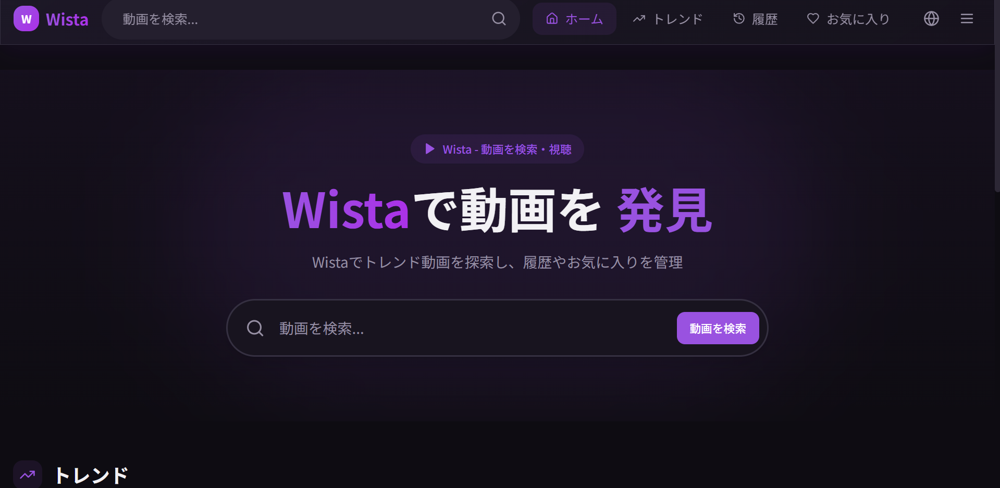

# WISTA

YouTube の代替を目指した、非商用・自由利用を前提とする  
動画視聴 Web アプリケーションです。

🌐 **公式サイト**: https://wista.f5.si

---

## スクリーンショット

### ログイン画面

### ホーム画面

### トレンド画面

### 設定画面

---

## ライセンス（日本語）

本プロジェクトは  
**Wista 非商用コピーレフト・事前通知義務ライセンス  
（Wista Non-Commercial Copyleft License with Prior Notice / WNCCL-PN v1.0）**  
のもとで公開されています。

### 主な条件
- 本ソフトウェアの **商用利用は禁止** されています
- 改変・派生・再配布を行う場合、**同一ライセンスでの公開が必須** です
- 改変・Fork・再配布・公開デプロイを行う際は、  
  **事前に Wista Project への通知が必須** です

### 通知先
- GitHub Issue: https://github.com/wista-project
- メール: wista-project@outlook.jp

詳細は `LICENSE` ファイルをご確認ください。

---

## 商用利用をご希望の方へ

本プロジェクトは **非商用利用のみ許可** されていますが、  
商用利用・業務利用・収益化を伴う利用については、  
**個別にライセンス許諾を行う場合があります**。

商用利用をご希望の場合は、以下のいずれかの方法でご連絡ください。

- GitHub Issue: https://github.com/wista-project  
  （※ 商用問い合わせ用 Issue テンプレートをご利用ください）
- メール: wista-project@outlook.jp

その際、利用目的・利用形態の概要をお知らせください。

---

## License (English)

This project is licensed under the  
**Wista Non-Commercial Copyleft License with Prior Notice (WNCCL-PN) v1.0**

- Commercial use is prohibited
- Derivative works must be released under the same license
- Prior notification to the Wista Project is mandatory before modification, redistribution, or public deployment

---

## 開発について

本プロジェクトは、以下の技術を使用して開発されています。

- React  
- TypeScript  
- Vite  

SPA（Single Page Application）として構成されています。

---

## デプロイ・改変について

デプロイや改変は禁止していませんが、  
**実施前に Issues 等での事前通知がライセンス上必須** です。

以下の環境でのデプロイに対応しています。

- Render  
- GitHub Pages  

---

## プロジェクト概要

WISTA は、複数の API を組み合わせて構築された  
**YouTube 代替 Web アプリケーション**です。

### 主な特徴

- 地域制限を回避した動画視聴
- 日本語・英語対応
- アメリカ / フランス / イギリスのトレンド取得
- 複数の再生方式に対応  
  - ブロック環境でも再生可能  
  - 音声のみの再生にも対応
- 動画ダウンロード機能を実装

---

> WISTA は、非商用かつ自由な動画視聴環境を守ることを目的としたプロジェクトです。
